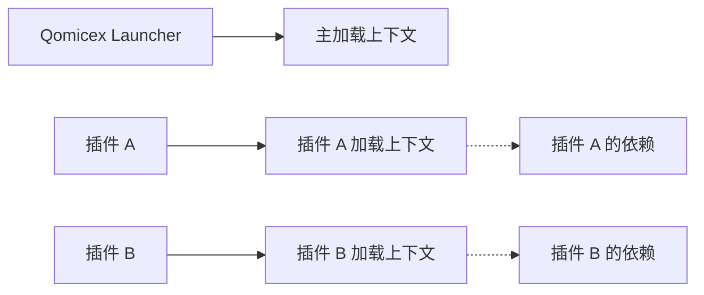

# PluginLoadContext 类

`PluginLoadContext` 是插件加载上下文类，负责管理插件的程序集加载和依赖解析。

## 命名空间

```csharp
namespace Qomicex.PluginSDK.Core
```

## 类定义

```csharp
public class PluginLoadContext : AssemblyLoadContext
{
    public PluginLoadContext(string pluginPath, bool isCollectible = true);

    protected override Assembly? Load(AssemblyName assemblyName);
}
```

## 构造函数

```csharp
public PluginLoadContext(string pluginPath, bool isCollectible = true)
```

创建插件加载上下文。

**参数：**

| 参数 | 类型 | 描述 |
|------|------|------|
| `pluginPath` | string | 插件程序集的文件路径 |
| `isCollectible` | bool | 是否可收集（默认为 true），设置为 true 允许在卸载时回收资源 |

## 方法

### Load

```csharp
protected override Assembly? Load(AssemblyName assemblyName)
```

加载指定名称的程序集，由加载上下文内部调用。

**参数：**

| 参数 | 类型 | 描述 |
|------|------|------|
| `assemblyName` | AssemblyName | 要加载的程序集名称 |

**返回值：**

| 类型 | 描述 |
|------|------|
| `Assembly?` | 加载的程序集，如果找不到则返回 null |

## 工作原理

`PluginLoadContext` 继承自 .NET 的 `AssemblyLoadContext`，为每个插件创建独立的加载上下文：

1. **依赖隔离**：每个插件有独立的程序集加载环境
2. **依赖解析**：自动解析插件及其依赖程序集
3. **版本隔离**：允许不同插件使用不同版本的依赖库



## 使用场景

### 1. 插件加载

插件系统内部使用，通常不需要插件开发者直接使用：

```csharp
// 插件系统内部代码示例
var pluginPath = "C:/Plugins/MyPlugin.dll";
var loadContext = new PluginLoadContext(pluginPath);

// 加载插件程序集
var pluginAssembly = loadContext.LoadFromAssemblyPath(pluginPath);

// 查找插件类型
var pluginType = pluginAssembly.GetTypes()
    .FirstOrDefault(t => t.GetCustomAttribute<PluginAttribute>() != null);
```

### 2. 卸载插件

卸载插件时释放加载上下文：

```csharp
// 插件系统内部代码示例
loadContext.Unload();
```

## 注意事项

1. **程序集隔离**：插件无法访问主程序集的内部类型
2. **共享依赖**：共享的程序集会被加载到主上下文中
3. **资源释放**：卸载时确保 `isCollectible` 设置为 true
4. **调试**：程序集加载问题可以通过日志调试

## 相关文档

- [IPlugin](../core-interfaces/IPlugin.md)
- [生命周期](../../lifecycle/index.md)
- [构建与部署](../../getting-started/build-deploy.md)
