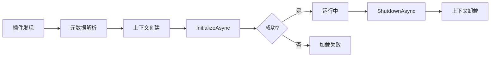

# 生命周期概览

理解插件的生命周期是开发高质量插件的关键。本文档介绍插件从加载到卸载的完整生命周期。

## 生命周期阶段

插件的生命周期包含以下阶段：



## 详细阶段说明

### 1. 插件发现

Qomicex Launcher 启动时扫描插件目录：

```csharp
// 插件目录结构
Plugins/
├── PluginA.dll
├── PluginB.dll
└── PluginC.dll
```

### 2. 元数据解析

系统读取 `PluginAttribute` 获取插件元数据：

```csharp
[Plugin("qomicex.example.myplugin", "我的插件", "1.0.0")]
public class MyPlugin : IPlugin
{
    // ...
}
```

### 3. 上下文创建

为插件创建独立的加载上下文（`PluginLoadContext`），隔离依赖：

```csharp
// 每个插件都有独立的加载上下文
var loadContext = new PluginLoadContext(pluginPath, isCollectible: true);
```

### 4. 初始化（InitializeAsync）

调用插件的 `InitializeAsync` 方法：

- 接收 `IServiceProvider` 以访问应用服务
- 返回 `Result<bool, PluginError>` 表示初始化结果
- 成功：插件进入运行状态
- 失败：插件被标记为加载失败

### 5. 运行中

插件完全加载并处于活动状态：

- 可以响应应用事件
- 可以访问提供的服务
- 可以执行后台任务

### 6. 关闭（ShutdownAsync）

应用关闭或插件卸载时调用 `ShutdownAsync`：

- 清理资源
- 保存状态
- 取消后台任务

### 7. 上下文卸载

释放插件加载上下文和相关资源。

## 生命周期事件

| 事件 | 描述 |
|------|------|
| `OnLoading` | 插件开始加载 |
| `OnLoaded` | 插件加载完成 |
| `OnInitializing` | 开始初始化 |
| `OnInitialized` | 初始化完成 |
| `OnShuttingDown` | 开始关闭 |
| `OnShutdown` | 关闭完成 |
| `OnUnloading` | 开始卸载 |
| `OnUnloaded` | 卸载完成 |

## 初始化失败处理

如果 `InitializeAsync` 返回失败结果：

```csharp
public Task<Result<bool, PluginError>> InitializeAsync(IServiceProvider services)
{
    // 错误场景
    return Task.FromResult(Result<bool, PluginError>.Failure(new PluginError
    {
        Code = "DEPENDENCY_MISSING",
        Message = "缺少必需的依赖服务"
    }));
}
```

系统会：
1. 记录错误信息
2. 显示错误通知
3. 标记插件为"加载失败"状态

## 资源管理建议

### 使用 IDisposable

```csharp
[Plugin("qomicex.example.myplugin", "我的插件", "1.0.0")]
public class MyPlugin : IPlugin, IDisposable
{
    private IResourceService? _resourceService;

    public Task<Result<bool, PluginError>> InitializeAsync(IServiceProvider services)
    {
        _resourceService = services.GetService(typeof(IResourceService)) as IResourceService;
        // ...
    }

    public Task<Result<bool, PluginError>> ShutdownAsync()
    {
        // 清理资源
        return Task.FromResult(Result<bool, PluginError>.Success(true));
    }

    public void Dispose()
    {
        _resourceService?.Dispose();
    }
}
```

### 使用 IAsyncDisposable

```csharp
[Plugin("qomicex.example.myplugin", "我的插件", "1.0.0")]
public class MyPlugin : IPlugin, IAsyncDisposable
{
    private Timer? _timer;

    public Task<Result<bool, PluginError>> InitializeAsync(IServiceProvider services)
    {
        _timer = new Timer(OnTimerTick, null, 1000, 1000);
        // ...
    }

    public async ValueTask DisposeAsync()
    {
        if (_timer != null)
        {
            await _timer.DisposeAsync();
            _timer = null;
        }
    }

    private void OnTimerTick(object? state)
    {
        // 定时器逻辑
    }
}
```

## 下一步

- [初始化流程详解](initialization.md)
- [运行时管理](runtime.md)
- [关闭流程详解](shutdown.md)
