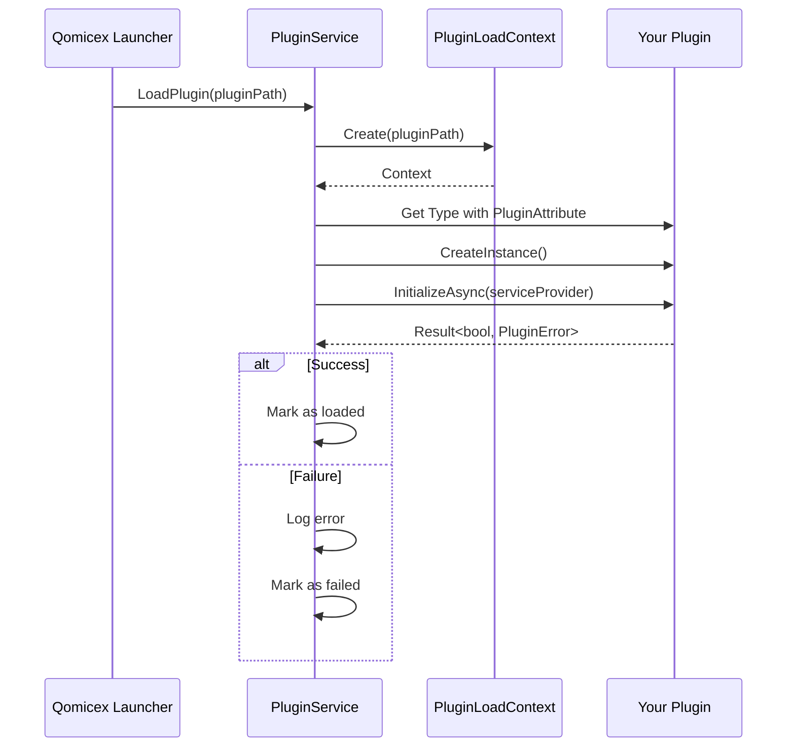

# 初始化流程

初始化是插件生命周期的关键阶段，本文档详细介绍初始化流程。

## 初始化流程图



## InitializeAsync 方法签名

```csharp
public Task<Result<bool, PluginError>> InitializeAsync(IServiceProvider services)
```

### 参数说明

| 参数 | 类型 | 描述 |
|------|------|------|
| `services` | IServiceProvider | 服务提供者，用于获取应用服务 |

### 返回值说明

| 类型 | 描述 |
|------|------|
| `Result<bool, PluginError>` | 成功返回 `Success(true)`，失败返回 `Failure(PluginError)` |

## 初始化最佳实践

### 1. 验证依赖

```csharp
public Task<Result<bool, PluginError>> InitializeAsync(IServiceProvider services)
{
    // 检查必需的服务
    var toastService = services.GetService(typeof(IToastService));
    if (toastService == null)
    {
        return Task.FromResult(Result<bool, PluginError>.Failure(new PluginError
        {
            Code = "SERVICE_NOT_FOUND",
            Message = "IToastService 服务不可用"
        }));
    }

    // 检查配置
    if (!ValidateConfiguration())
    {
        return Task.FromResult(Result<bool, PluginError>.Failure(new PluginError
        {
            Code = "INVALID_CONFIG",
            Message = "插件配置无效"
        }));
    }

    return Task.FromResult(Result<bool, PluginError>.Success(true));
}

private bool ValidateConfiguration()
{
    // 验证配置逻辑
    return true;
}
```

### 2. 缓存服务引用

```csharp
public class MyPlugin : IPlugin
{
    private IToastService? _toastService;
    private IConfigurationService? _configService;

    public Task<Result<bool, PluginError>> InitializeAsync(IServiceProvider services)
    {
        // 缓存服务引用
        _toastService = services.GetService(typeof(IToastService)) as IToastService;
        _configService = services.GetService(typeof(IConfigurationService)) as IConfigurationService;

        // 验证服务
        if (_toastService == null || _configService == null)
        {
            return Task.FromResult(Result<bool, PluginError>.Failure(new PluginError
            {
                Code = "MISSING_SERVICES",
                Message = "缺少必需的服务"
            }));
        }

        return Task.FromResult(Result<bool, PluginError>.Success(true));
    }
}
```

### 3. 加载配置

```csharp
public class MyPlugin : IPlugin
{
    private IConfigurationService? _configService;
    private PluginConfiguration? _config;

    public Task<Result<bool, PluginError>> InitializeAsync(IServiceProvider services)
    {
        _configService = services.GetService(typeof(IConfigurationService)) as IConfigurationService;

        if (_configService == null)
        {
            return Task.FromResult(Result<bool, PluginError>.Failure(new PluginError
            {
                Code = "MISSING_CONFIG_SERVICE",
                Message = "IConfigurationService 不可用"
            }));
        }

        // 加载配置
        _config = _configService.Load<PluginConfiguration>(Id);
        _config ??= new PluginConfiguration(); // 使用默认配置

        return Task.FromResult(Result<bool, PluginError>.Success(true));
    }
}

public class PluginConfiguration
{
    public bool EnableFeature { get; set; } = true;
    public string ApiKey { get; set; } = string.Empty;
}
```

### 4. 初始化资源

```csharp
public class MyPlugin : IPlugin
{
    private HttpClient? _httpClient;
    private Timer? _timer;

    public Task<Result<bool, PluginError>> InitializeAsync(IServiceProvider services)
    {
        try
        {
            // 初始化 HttpClient
            _httpClient = new HttpClient
            {
                Timeout = TimeSpan.FromSeconds(30)
            };

            // 初始化定时器
            _timer = new Timer(OnTimerTick, null, 1000, 5000);

            return Task.FromResult(Result<bool, PluginError>.Success(true));
        }
        catch (Exception ex)
        {
            return Task.FromResult(Result<bool, PluginError>.Failure(new PluginError
            {
                Code = "INIT_ERROR",
                Message = ex.Message
            }));
        }
    }

    private void OnTimerTick(object? state)
    {
        // 定时任务
    }

    // 在 ShutdownAsync 中清理资源
}
```

### 5. 显示成功消息

```csharp
public Task<Result<bool, PluginError>> InitializeAsync(IServiceProvider services)
{
    var toastService = services.GetService(typeof(IToastService)) as IToastService;

    try
    {
        // 初始化逻辑

        toastService?.Success($"{Name} v{Version} 初始化成功！");
        return Task.FromResult(Result<bool, PluginError>.Success(true));
    }
    catch (Exception ex)
    {
        toastService?.Error($"{Name} 初始化失败: {ex.Message}");
        return Task.FromResult(Result<bool, PluginError>.Failure(new PluginError
        {
            Code = "INIT_EXCEPTION",
            Message = ex.Message
        }));
    }
}
```

## 错误代码规范

使用标准化的错误代码：

```csharp
// 服务相关
SERVICE_NOT_FOUND = "SERVICE_NOT_FOUND"
MISSING_SERVICE = "MISSING_SERVICE"

// 配置相关
INVALID_CONFIG = "INVALID_CONFIG"
CONFIG_NOT_FOUND = "CONFIG_NOT_FOUND"
MISSING_CONFIG_SERVICE = "MISSING_CONFIG_SERVICE"

// 初始化相关
INIT_ERROR = "INIT_ERROR"
INIT_TIMEOUT = "INIT_TIMEOUT"
INIT_FAILED = "INIT_FAILED"

// 依赖相关
DEPENDENCY_MISSING = "DEPENDENCY_MISSING"
DEPENDENCY_VERSION_MISMATCH = "DEPENDENCY_VERSION_MISMATCH"

// 权限相关
PERMISSION_DENIED = "PERMISSION_DENIED"
INSUFFICIENT_PRIVILEGES = "INSUFFICIENT_PRIVILEGES"
```

## 初始化性能建议

1. **异步操作**：使用 `async/await` 处理耗时操作
2. **超时处理**：为网络请求和外部操作设置超时
3. **延迟加载**：非关键资源可延迟加载
4. **缓存策略**：缓存可重用的对象和数据

## 下一步

- [运行时管理](runtime.md)
- [关闭流程详解](shutdown.md)
- [API 参考](../api/index.md)
